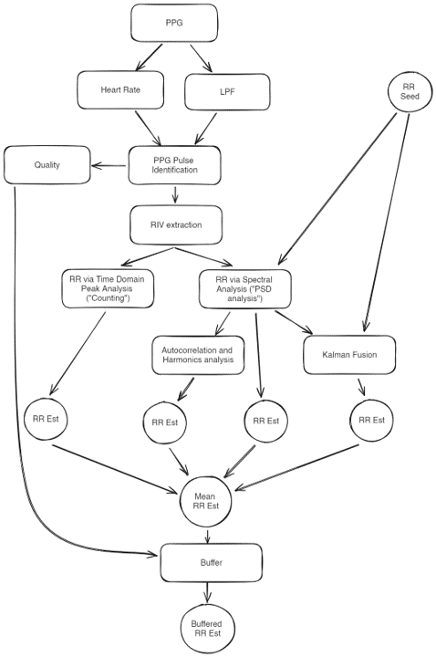

# PULSE ROXI: PPG to RR estimation
Estimate Heart Rate and Respiratory Rate (RR) for a photoplethysmography (PPG) waveform.

This repo is a copy created in August 2025 at the conclusion of the project. At that time, the algorithm had been evaluated using the 509 sessions of the 3Ps dataset.

This readme was created more than a year earlier by previous contributors to the project, before the 3Ps study. Parts of this readme are out of date but most of it is still applicable.


**Table of Contents**
- [PULSEOX\_PUBALGS: PPG to RR estimation](#pulseox_pubalgs-ppg-to-rr-estimation)
- [Overview](#overview)
- [Developer get started](#developer-get-started)
- [Example Usage](#example-usage)
- [Datasets for evaluation](#datasets-for-evaluation)
- [Bench Data](#bench-data)
- [Current Performance](#current-performance)
- [Known performance/generalization issues](#known-performancegeneralization-issues)
- [In Development](#in-development)
- [References](#references)

# Overview
The general approach of the algorithm is to estimate RR using various respiratory-induced variations (RIVs) in both time and frequency domains to generate a large set of "respiratory candidates". These candidates are fused together to produce a final RR estimate.

The current fusion method is a step-wise process that is manually derived. I have not achieved any performance gains using ML or statistical method to fuse the candidates. Maybe you can achieve more success.

This algorithm is developed using mostly the Kapiolani and Capnobase datasets. The characteristics of PPG data in these datasets are vastly different. The algorithm is currently showing acceptable performance in the Kapiolani dataset, but only power spectral density (PSD) analyses and kalman analysis results produce accurate estimates on the Capnobase and MIMIC datasets. More info on these datasets [below](https://github.com/new-horizons/pulseox_pubalgs?tab=readme-ov-file#datasets-for-evaluation).

<div class="foo">
<table width="100%;">
  <tr>
    <td width="50%">
        
    </td>
    <td with="50%">
      <ul>
        <li>PPG: Download datasets and place them in the <code>data</code> directory</li>
        <li>Heart Rate: <code>heart_rate.py</code>, and called in <code>rr_est.estimate_rr_single_frame</code></li>
        <li>LPF (butterworth low pass filter): <code>util.py</code></li>
        <li>PPG pulse identification: <code>riv_est.extract_rivs</code>, and specifically, <code>riv_est.extract_ppg_features</code></li>
        <li>Quality: <code>signal_quality.template_match_similarity</code></li>
        <li>Time domain analysis: <code>riv_analyses.peak_counting_analysis</code></li>
        <li>Spectral analysis: <code>riv_analyses.psd_analysis</code></li>
        <li>Autocorrelation and Harmonics analysis: called in <code>riv_analyses.psd_analysis</code></li>
        <li>Kalman Fusion: <code>riv_analyses.kalman_analysis</code></li>
        <li>RR estimation down-selection: see "RR candidate Fusion" in <code>rr_est.estimate_rr_single_frame</code></li>
        <li>Buffer: <code>riv_analyses.rr_display_buffer</code></li>
        <li>RR seed: an initial guess for the current RR estimation. In the future, RR_seed should be pulled from a lookup table, based on the age of the patient.</li>
      </ul>
    </td>
  </tr>
</table>
</div>

# Developer get started
I use [poetry](https://python-poetry.org/docs/) as dependency manager and conda as my environment manager. To get started:
1. Create a virtual environment with environment manager of your choice. For conda, do

        conda create --name ppg2rr python=3.10 --yes
    Then activate the environment with

        conda activate ppg2rr
2. Install dependencies using

        poetry install

# Example Usage
**PREREQUISITE**: have the datasets downloaded and placed in the data directory

See `notebooks/` for more examples. For new developers, see the `readme` in the `notebooks` directory for recommended order to read the notebooks in.

To analyze specific frame(s) within a trial, or the summary of RR estimations for an entire trial:

```py
from ppg2rr.rr_est import estimate_rr
from ppg2rr.config import AlgorithmParams

dataset = 'kapiolani'
trial = 52
# frame_num = None # analyse all frames in a trial
frame_num=[4] # specify the frames you want to analyze

params = AlgorithmParams(
    dataset=dataset,
    probe=1,
    remove_riv_outliers="segment-wise"
    )
(
    frame_data,
    rr_candidate_merged_list,
    all_rr_candidates_list,
    feature_quality_list,
    meta,
) = estimate_rr(
    trial_num=trial,
    frame_num=frame_num,
    params=params,
    dataset=dataset,
    show=True,
    save_fig=False,
    rr_seed=10,
)
```

To estimate RR on your own PPG data, using mostly the default parameters:

```py
import pandas as pd
from ppg2rr.rr_est import estimate_rr_single_frame

df = pd.read_csv('../tests/resources/ppg_waveforms/ppg_kapiolanip1-65-24.csv')
ppg = df['0']
ppg_sampling_frequency = 125 # Kapiolani sampling frequency

(
    rr_candidate_merged,
    all_rr_candidates,
    feature_quality,
    hr_est,
) = estimate_rr_single_frame(
    ppg = ppg,
    fs_ppg = ppg_sampling_frequency,
    min_resp_freq = 5/60,
    fs_riv=10,
    n_sig=3,
    show=True, # Set to False if you don't care about the details.
)


print(f"Estimated heart rate: {hr_est['estimate']:.1f} beats per minute")
print(f"HR Estimation reliable: {hr_est['reliable']}")
print(f"Estimated breathing rate: {rr_candidate_merged['mean of fused candidates']:.1f} breaths per minute")
```

Estimate RR for an entire dataset or for select trials within a dataset:
```py
from ppg2rr.rr_est import estimate_rr_dataset
from ppg2rr.config import AlgorithmParams

dataset='capnobase'
params = AlgorithmParams(
    dataset=dataset,
    probe=1,
    remove_riv_outliers="segment-wise"
    )

# trials = None
# trials = [1,2,3,5]

df, rr_candidates, quality_indices = estimate_rr_dataset(
    dataset=dataset,
    trials=None, # if List of integers are given, then only run those trials
    params=params,
    save_df=False,
    show=False,
    save_fig=False,
)
```
If `save_df = True`, then the results are saved to a `.csv` file in `data/results`. See the [output data dictionary](https://github.com/new-horizons/pulseox_pubalgs/wiki/Algorithm-output-Data-Dictionary) for more details.

# Datasets for evaluation
[Synthetic dataset](https://egnyte.nhgh.org/app/index.do#storage/files/1/Shared/Projects/Pediatric%20Pulse%20ROxi/alg%20development/pulseox_pubalgs_data) ("synthetic"): Created by adding amplitude, frequency, or baseline modulation to simulated waveforms. Originally by [Peter Charlton (2016)](https://peterhcharlton.github.io/RRest/synthetic_dataset.html).

[Kapiolani](https://egnyte.nhgh.org/app/index.do#storage/files/1/Shared/Projects/Pediatric%20Pulse%20ROxi/Pediatric%20Observational%20Study/Kapiolani%20format-corrected%20data) ("kapiolani"): Collected from pediatric patients under five year old during clinical visits. They're awake and sometimes are calm, but sometimes they may be moving about or crying.

[Capnobase](https://egnyte.nhgh.org/app/index.do#storage/files/1/Shared/Projects/Pediatric%20Pulse%20ROxi/Published%20data/Capnobase) ("capnobase"): Data is collected in patients under anesthesia during elective surgery. There are around 5 kids under 5 y.o. in this dataset. More details [here](https://peterhcharlton.github.io/RRest/capnobase_dataset.html).

[MIMIC-II](https://peterhcharlton.github.io/RRest/mimicii_dataset.html) ("mimic"): can be downloaded on [physionet](https://physionet.org/content/bidmc/1.0.0/). Simultaneous ECG, PPG and impedance pneumography respiratory signals acquired from intensive care patients. More details [here](https://www.ncbi.nlm.nih.gov/pmc/articles/PMC3124312/). There are no children in this dataset, and all subjects have normal breathing rates (between 5 and 25)

[BIDMC Dataset](https://peterhcharlton.github.io/RRest/bidmc_dataset.html): Simultaneous ECG, PPG and thoracic impedance signals recorded from critically-ill patients. The algorithm has not been evaluated with this dataset.

# Bench Data
Bench data was collected to evaluate hardware during development of the V0 system prior to the Nigeria study. They can be found on [Egnyte](https://egnyte.nhgh.org/app/index.do#storage/files/1/Shared/Projects/Pediatric%20Pulse%20ROxi/alg%20development/pulseox_pubalgs_data/bench).

# Current Performance
See the [wiki](https://github.com/new-horizons/pulseox_pubalgs/wiki)

# Known performance/generalization issues
The Capnobase and MIMIC datasets have relatively "clean" data. The PPG spectra often contains a peak at the expected RR as well as harmonics of that frequency. For the most part, the harmonic analysis method can successfully pick out the fundamental RR frequency in these datasets. But the counting methods almost always estimates the harmonic frequencies. Note that the majority of patients in these datasets are adults.

In the Kapiolani dataset, the PPG spectra is less clean, and the counting methods often perform better than the spectral methods.

# In Development
TODO: Create a database combining Kapiolani, Capnobase, MIMIC, and other datasets for further development and evaluation.

TODO: Initialize RR_seed with a lookup table, based on the age of the patient.

TODO: Further improve the harmonic analysis method using examples from the MIMIC dataset.

# References
The algorithm is inspired by the following papers:

The main idea of RIV extraction followed by RR estimation:

    Karlen, W., Raman, S., Ansermino, J. M., & Dumont, G. A. (2013).
    Multiparameter respiratory rate estimation from the photoplethysmogram.
    IEEE Transactions on Biomedical Engineering, 60(7), 1946–1953.
    https://doi.org/10.1109/TBME.2013.2246160

All the different possible PPG features:

    Elgendi, M. (2012). On the Analysis of Fingertip Photoplethysmogram Signals. Current Cardiology Reviews, 8(1), 14–25. https://doi.org/10.2174/157340312801215782

    Finnegan et al., (2023). Features from the photoplethysmogram and the electrocardiogram for estimating changes in blood pressure. Scientific Reports, 13(1), 1–20. https://doi.org/10.1038/s41598-022-27170-2

Pulse and Peak identification technique:

    Hanyu, S. & Xiaohui, C. Motion artifact detection and reduction
    in PPG signals based on statistics analysis. in 2017 29th Chinese
    Control And Decision Conference (CCDC) 3114-3119 (IEEE, 2017).
    doi:10.1109/CCDC.2017.7979043

Kalman Fusion:

    Khreis, S., Ge, D., Rahman, H. A., & Carrault, G. (2020). Breathing Rate
    Estimation Using Kalman Smoother with Electrocardiogram and Photoplethysmogram.
    IEEE Transactions on Biomedical Engineering, 67(3), 893–904.
    https://doi.org/10.1109/TBME.2019.2923448

Signal Quality:

    Orphanidou et al., 2015, "Signal-quality indices for the electrocardiogram
    and photoplethysmogram: derivation and applications to wireless monitoring".

    Huthart S, Elgendi M, Zheng D, Stansby G, Allen J. Advancing PPG Signal
    Quality and Know-How Through Knowledge Translation-From Experts to Student
    and Researcher. Front Digit Health. 2020 Dec 21; doi: 10.3389/fdgth.2020.619692.
