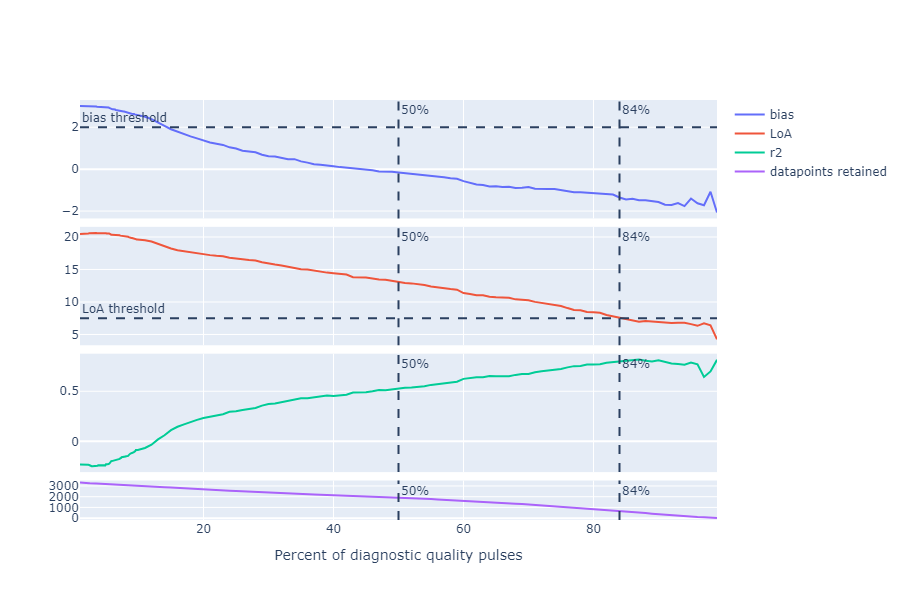
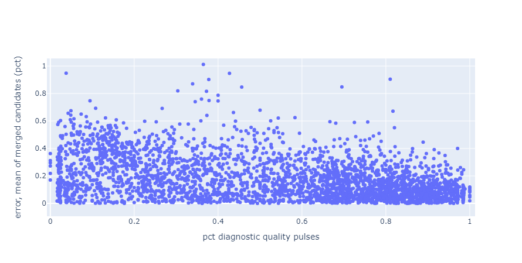
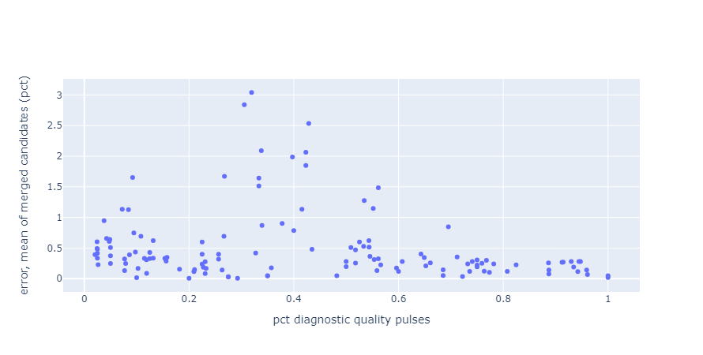
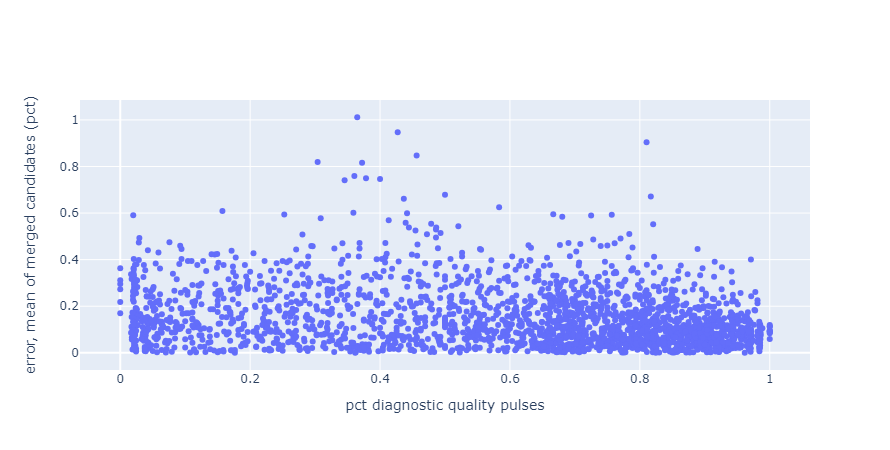
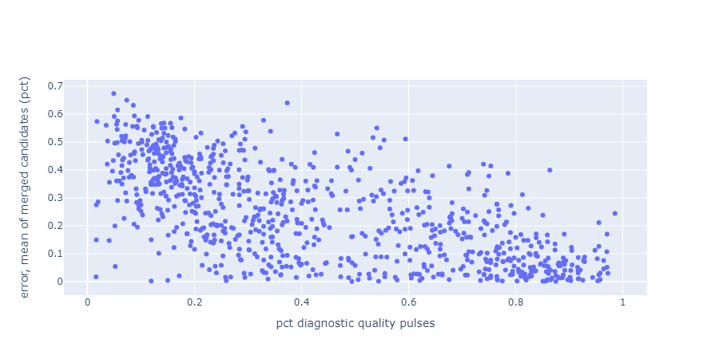

# Summary
In theory, the algorithm should have better performance if given higher quality signals. Therefore, signal quality can be used as a proxy for performance confidence.

We have identified a measure of quality, implemented in [`template_match_similarity()`](https://github.com/new-horizons/pulseox_pubalgs/blob/63d46ad6d1ca3529b48028ccf2095f2ffdecf99c/ppg2rr/signal_quality.py#L189), based on the shapes of PPG pulses within 30 second analysis windows. In short, we look at the percentage of PPG pulses that is of "diagnostic quality" 30 second analysis window. We found that this percentage has a near linear correlation with overall algorithm performance when tested on the Kapiolani Dataset. **When excluding analysis windows with diagnostic quality pulses < 84%, the algorithm performs within our target average error and limits of agreement of 2 and 7.5 breaths per minute, respectively.**

This method is supported in the research community. [Huthart et al [1]](https://pubmed.ncbi.nlm.nih.gov/34713077/) found that the consenses to PPG quality was to:
* reject analysis window if percentage of diagnostic quality pulses < 50-74%
* to make correct diagnoses, diagnostic quality pulses in a frame > 86%

# Approach

## Wave shape quality
When the shape of a ppg pulse becomes distorted, or nonconformant to the ones before it, then it can mean
* sudden pressure changes, either physiologically or at the measurement site (e.g., contact pressure)
* relative movement between sensor and skin, resulting in poor measurement

These changes obfuscates the respiratory induced pressure changes and throws off the algorithm's calculations. Additionally it could make identifying fiduciary points on the PPG waveform, for example when the PPG waveform starts to fluctuate within a single pulse. Identifying these poor waveshapes, and the proportion of the frame they occupy, has been found to correlate with algorithm performance.

### Measurement of wave shape quality
[`template_match_similarity()`](https://github.com/new-horizons/pulseox_pubalgs/blob/63d46ad6d1ca3529b48028ccf2095f2ffdecf99c/ppg2rr/signal_quality.py#L189) is inspired by [Orphanidou et al., 2015](https://pubmed.ncbi.nlm.nih.gov/25069129/), "Signal-quality indices for the electrocardiogram and photoplethysmogram: derivation and applications to wireless monitoring", and takes the following steps to quantify the PPG quality:

1. Identify the maxima on a PPG waveform. Assume these correspond to the peaks of each pulse.

2. Collect each ppg pulse into a matrix, and calculate an average waveshape.
3. Center each pulse around 0.
4. Calculate
    * the correlation coefficient between each pulse to the average pulse, and
    * the standard deviation of each pulse (i.e., amplitude range), then identify the outliers using the median absolute deviation method.
5. Identify "nonconformant" waveforms based on the difference in correlation coefficient and amplitude outliers.

_Blue: Average waveform. Red: Pulses with nonconforming shapes. Dashed Orange: Pulses with nonconforming amplitudes. Solid Orange: Pulses with both nonconforming shape and amplitude_

6. Calculate the percentage of the frame these nonconformant pulses occupy
7.  `1 - percentage of nonconformant pulses = percentage of frame with diagnostic quality pulses`

### Relationship with algorithm performance on Kapiolani Dataset
In the figure below, I removed datapoints used in the performance calculation based on the percentage of nonconformant pulses in a frame (x-axis). Here I observed a near-linear relationship between each performance metric and the threshold of nonconformance.

Bias: Average error over all data points  
LoA: Limit of agreement, 1.96*standard deviation of all errors  
r2: correlation coefficient between measured and predicted respiratory rates  

When excluding all datapoints with < 84% nonconformance, this algorithm performs within the target of 2 breaths per minute for the bias and 7.5 breaths per minute for the LoA.

### Correlation with error upper bound
The error value on the y-axis is in terms of percentages. Error on this chart is defined by:

`err = abs(((df['RR ref co2'] - df['mean of fused candidates'])/df['RR ref co2']))`

# Error vs RR Range & Pct nonconformant pulses
Aliased frames and `(df['co2 mean iqr'] < 0.15)` has been excluded from the data shown.

| RR Range | Definition | Errors | Comments |
| -- | -- | -- | -- |
| Low | RR < 20 |  | No correlation |
| Mid | 20 >= RR < 45 | | Relatively linear upper bound between 30 and 65% error |
| High | RR >= 45 | | Linear upper bound between 15% and 65% error |

# Performance at Various Quality Thresholds
Since we typically think of "high quality" as 1 and "low quality" as 0, I'll define quality as `1-pct_nonconformant_pulses`.

Aliased frames and `(df['co2 mean iqr'] < 0.15)` has been excluded from the data shown.

| Quality | Correlation | Bland-Altman |
| -- | -- | -- |
| 0.84 |  |  |
| 0.5 |  |  |
| 0.2 |  | )

### References
[1] Huthart S, Elgendi M, Zheng D, Stansby G, Allen J. Advancing PPG Signal Quality and Know-How Through Knowledge Translation-From Experts to Student and Researcher. Front Digit Health. 2020 Dec 21;2:619692. doi: 10.3389/fdgth.2020.619692. PMID: 34713077; PMCID: PMC8521847.

[2] Orphanidou C, Bonnici T, Charlton P, Clifton D, Vallance D, Tarassenko L. Signal-quality indices for the electrocardiogram and photoplethysmogram: derivation and applications to wireless monitoring. IEEE J Biomed Health Inform. 2015 May;19(3):832-8. doi: 10.1109/JBHI.2014.2338351. Epub 2014 Jul 23. PMID: 25069129.

### Relevant PRs
https://github.com/new-horizons/pulseox_pubalgs/pull/20
https://github.com/new-horizons/pulseox_pubalgs/pull/24